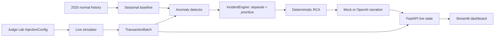

# The Control Tower

NextWave Hackathon 2026 · Challenge 2

The Control Tower is a live payment-operations demo for Rappi, Carrefour, and
Despegar across Mexico, Brazil, and Colombia. It converts simulated payment
attempts into interpretable incidents: seasonal anomaly detection, monetary
impact, deterministic root-cause analysis (RCA), evidence-bound narration, and a
merchant-scoped dashboard.

The product recommends an action; it never changes routing or remediates payments
automatically.

## What runs end to end



`InjectionConfig` stops at the simulator. The detector, RCA, LLM prompt, and
evaluation observations receive generated transactions or calculated evidence,
never the judge's answer.

Core components:

- Historical data: the committed
  `data/historical_transactions_2025_seed42.csv` is deterministic normal traffic.
  January–April trains the runtime baseline; later months remain validation/test
  data.
- Live simulator: seeded five-minute windows, aligned with the same volume,
  approval, provider, method, and bank behavior used by history.
- Baseline and detector: a smoothed seasonal merchant×country expectation,
  minimum-volume guard, absolute/statistical drop thresholds, and two-window
  persistence.
- Incident handling: independent incidents stay separate and are ordered by
  severity, estimated loss, anomaly score, then conversion drop.
- RCA: deterministic slice comparisons return either `confirmed` dimensions or
  `insufficient_evidence`. The LLM cannot change those facts.
- Dashboard: polls the backend and displays only the current real simulator batch,
  backend incidents, RCA, and recommendations. If FastAPI is unavailable, it
  shows an error and no fake live fallback.

## Install

Run from the repository root with Python 3.11+:

```bash
python3 -m venv .venv
source .venv/bin/activate
python -m pip install --upgrade pip
python -m pip install -r requirements.txt
cp .env.example .env
```

On Windows PowerShell, activate with `.venv\Scripts\Activate.ps1`.

The committed historical CSV is sufficient to start; no data-generation step is
required.

## Configuration and safe demo mode

`.env.example` is ready for deterministic mock narration:

```dotenv
OPENAI_API_KEY=
OPENAI_MODEL=gpt-5-mini
OPENAI_TIMEOUT_SECONDS=30
MOCK_MODE=true
CONTROL_TOWER_API_URL=http://127.0.0.1:8000
BACKEND_REQUEST_TIMEOUT_SECONDS=90
```

`MOCK_MODE=true` is the primary live-demo mode. It uses the real simulator,
detector, money calculation, IncidentEngine, and RCA; only the final wording is
local and deterministic. This avoids making the judge demo depend on Wi-Fi or an
external API.

For an intentional OpenAI narration and incident-assistant test, set a valid
`OPENAI_API_KEY` and `MOCK_MODE=false`. If OpenAI is unavailable, diagnosis
narration, routing rationale, and incident Q&A fall back to deterministic,
evidence-bound wording so the detected incident remains usable.

Never commit `.env`, API keys, tokens, or credentials.

## Start the product

Use two terminals, both at the repository root.

Terminal 1 — backend:

```bash
source .venv/bin/activate
uvicorn backend.main:app --reload --port 8000
```

Verify it:

```bash
curl http://127.0.0.1:8000/health
```

Expected response: `{"status":"ok"}`. API docs are at
<http://127.0.0.1:8000/docs>.

Terminal 2 — dashboard:

```bash
source .venv/bin/activate
streamlit run frontend/app.py
```

Open <http://127.0.0.1:8501>. No `PYTHONPATH` override or extra command is
required.

## Five-minute judge flow

1. Start in `MOCK_MODE=true` and open the dashboard.
2. Watch two or three normal windows update. No incident should appear.
3. Open **Judge Lab** on the right.
4. Choose a merchant and country, then select one **Anomaly scope**: all traffic,
   provider, payment method, or issuing bank.
5. Use a strong target approval rate (20% is the known-good demo value) and click
   **Inject incident**.
6. The simulator advances, the detector reacts automatically, and the dashboard
   shows the incident, impact, diagnosis status, evidence, and recommendation.
7. For an eligible routing recommendation, click **Approve recommendation** and
   then **Simulate application**. Inspect the before/expected/observed metrics and
   audit log, then choose **Revert simulated change** or **Complete review**.
8. Ask the incident assistant about the root cause, impact, or selected
   simulation and expand **Evidence used** to inspect its supporting facts.
9. Click **Reset demo** before repeating. This calls `POST /monitor/reset`; it is
   not a Streamlit-only reset.

Known-good injection: **Rappi · Brazil · Stripe · target 20% · 6 windows**.

The same injection can be submitted directly for diagnostics:

```bash
curl -X POST http://127.0.0.1:8000/injections \
  -H 'Content-Type: application/json' \
  -d '{"config":{"merchant":"Rappi","country":"Brazil","provider":"Stripe","target_approval_rate":0.2,"duration_windows":6}}'
```

Reset directly with:

```bash
curl -X POST http://127.0.0.1:8000/monitor/reset
```

## Tests and evaluation

Run the full test suite:

```bash
python -m pytest -q
```

Run all 30 deterministic evaluation scenarios and save both reports:

```bash
python -m backend.evaluation --output artifacts/evaluation
```

Outputs:

- `artifacts/evaluation/evaluation_results.json`
- `artifacts/evaluation/evaluation_summary.md`

The harness separately reports detection recall, false-positive rate, confirmed
root-cause accuracy, abstention accuracy, simultaneous-incident separation, and
mean latency. Estimated-loss error remains explicitly unavailable because the
catalog has no independent ground-truth loss label.

## Supported Judge Lab scope

Supported trial-by-fire injections are statistically observable slices:

- merchant + country;
- merchant + country + one provider;
- merchant + country + one payment method;
- merchant + country + one issuing bank;
- decline-code degradation when enough declines are present;
- intersections only when they contain enough traffic (evaluation coverage, not
  the primary Judge Lab promise).

Both Judge Lab surfaces render only the filter selected by **Anomaly scope**, so
multiple optional slice filters cannot be submitted accidentally. Ultra-narrow
intersections and mild changes can fall below the detector's merchant×country
minimum-volume/signal policy and are intentionally not promised. See
[`docs/judge_lab_scope_limitations.md`](docs/judge_lab_scope_limitations.md) for
the exact UI contract, reset behavior, and scope rationale.

## Known limitations and fallback strategy

- Detection happens at merchant×country level. Three narrow intersection cases
  and the random narrow catalog case currently fall below detection support.
- A mild second incident in evaluation scenario 25 is statistically too small;
  strong simultaneous scenarios 22–24 are the supported acceptance cases.
- Deterministic RCA abstains when one cause cannot be isolated. The UI preserves
  that result and labels candidate evidence as unconfirmed.
- Active incidents do not auto-resolve after recovery; use **Reset demo** between
  rehearsals.
- Money impact is a non-negative estimate of excess expected approvals multiplied
  by observed average approved amount and scaled per hour. There is no independent
  loss ground truth, so no loss-error accuracy is claimed.
- Runtime state is in memory: no database, authentication, durable incident
  history, multi-user isolation, or automatic remediation.
- If the OpenAI path is unhealthy, the application automatically uses its
  deterministic evidence-bound fallback. `MOCK_MODE=true` remains the most
  predictable presentation mode and the full product works without an API key.

## Main API paths

| Method | Path | Purpose |
|---|---|---|
| `GET` | `/health` | Backend readiness |
| `POST` | `/monitor/tick` | Advance one real simulated window |
| `GET` | `/monitor/latest-batch` | Latest transactions used by dashboard KPIs |
| `POST` | `/monitor/reset` | Clean simulator/detector/RCA/live lifecycle |
| `POST` | `/injections` | Activate a judge-controlled simulator change |
| `GET` | `/merchants/{merchant}/incidents` | Merchant-scoped diagnosed incidents in backend priority order |
| `POST` | `/incidents/{incident_id}/assistant` | Evidence-only Q&A for one merchant-owned incident |
| `POST` | `/remediation/approvals` | Record a human approval or rejection |
| `GET` | `/remediation/workflows/{recommendation_id}` | Read the human-gated workflow state |
| `POST` | `/remediation/changes` | Activate a local dry-run change after approval |
| `GET` | `/remediation/changes/{change_id}` | Read before/after monitoring metrics |
| `POST` | `/remediation/changes/{change_id}/rollback` | Revert the local simulated change |
| `POST` | `/remediation/changes/{change_id}/complete` | Complete the simulated review |
| `GET` | `/remediation/audit` | Read the append-only in-memory audit trail |

The legacy `/analyze` starter route remains for compatibility; it is not the
Control Tower demo path.
