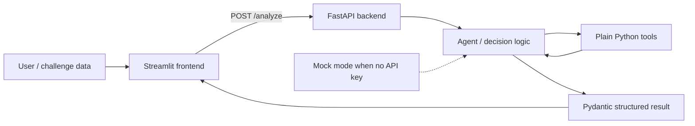

# NextWave AI Hackathon Practice Starter

A deliberately small practice kit for turning an unknown challenge into a working AI demo in a few hours. It provides one clean happy path: Streamlit collects input, FastAPI validates it, an OpenAI-powered decision layer calls plain Python tools, and the UI renders a structured Pydantic result.

It is generic by design. The sample records and decision rules are placeholders, not a solution to the unrevealed challenge.

## Architecture



No database, authentication, Docker, orchestration framework, or external service is required.

## Project structure

```text
.
├── backend/
│   ├── __init__.py
│   ├── agent.py       # OpenAI tool loop + deterministic mock flow
│   ├── config.py      # Environment settings and mock-mode selection
│   ├── main.py        # FastAPI /health and /analyze routes
│   ├── schemas.py     # Pydantic API contracts
│   └── tools.py       # Three replaceable sample tools
├── frontend/
│   └── app.py         # Streamlit demo UI
├── data/
│   └── sample_data.csv
├── tests/
│   └── test_health.py
├── .env.example
├── .gitignore
├── pytest.ini         # Limits test discovery to this starter's tests
├── requirements.txt
└── README.md
```

## Install on macOS

Run from this repository root:

```bash
python3 -m venv .venv
source .venv/bin/activate
python -m pip install --upgrade pip
python -m pip install -r requirements.txt
cp .env.example .env
```

## Configure OpenAI or use mock mode

The copied `.env` works immediately without an API key. With `OPENAI_API_KEY` blank, the backend automatically uses mock mode and still runs all three Python functions locally.

To use OpenAI, edit `.env`:

```dotenv
OPENAI_API_KEY=your_key_here
OPENAI_MODEL=gpt-5-mini
MOCK_MODE=false
```

Never commit `.env`; it is ignored by Git. Set `MOCK_MODE=true` whenever you want deterministic, zero-credit testing even if a key is present.

The OpenAI path follows the Responses API patterns for [function calling](https://developers.openai.com/api/docs/guides/function-calling) and [Pydantic structured outputs](https://developers.openai.com/api/docs/guides/structured-outputs).

## Run the demo

Start FastAPI in terminal 1:

```bash
source .venv/bin/activate
uvicorn backend.main:app --reload --port 8000
```

FastAPI docs are available at <http://localhost:8000/docs>. Verify health with:

```bash
curl http://localhost:8000/health
```

Start Streamlit in terminal 2:

```bash
source .venv/bin/activate
streamlit run frontend/app.py
```

Open <http://localhost:8501>, keep the default `REC-001`, and click **Analyze**. Try `REC-002` and `REC-003` to see different deterministic outcomes.

Run the test suite from terminal 3 (or after stopping a server):

```bash
source .venv/bin/activate
pytest
```

## Change these files after the challenge reveal

Search for `CHANGE THIS AFTER CHALLENGE REVEAL`, then focus on only these files:

1. `backend/schemas.py` — shape the challenge input and structured result.
2. `backend/tools.py` — replace sample data access and implement 2–4 useful tools.
3. `backend/agent.py` — replace the instructions and update the mock happy path.
4. `frontend/app.py` — capture the real input and present the most convincing result.
5. `data/sample_data.csv` — replace or supplement the placeholder data if needed.

`backend/main.py` and `backend/config.py` should usually remain unchanged.

## Hackathon adaptation checklist

- [ ] Write the business decision in one sentence.
- [ ] Define the smallest useful input and output schemas.
- [ ] Implement only 2–4 tools required for the strongest happy path.
- [ ] Replace the generic agent instructions and mock rules.
- [ ] Load one realistic challenge example.
- [ ] Make one end-to-end case excellent before adding edge cases.
- [ ] Test `/health`, `/analyze`, error states, and the Streamlit result card.
- [ ] Keep mock mode ready in case API access or Wi-Fi fails during the demo.
- [ ] Re-scan staged files for secrets before committing.
- [ ] Rehearse the demo with a short backup script and known-good input.
