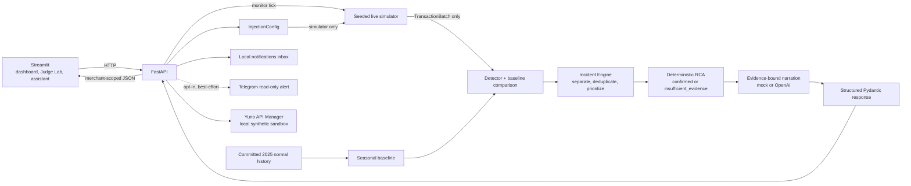

# Team Moche — Final Hackathon Submission

## 1. Identification

- **Team:** Team Moche
- **Challenge:** NextWave Hackathon 2026 — Challenge 2: The Control Tower
- **Team members:** Victoria Persico, Sofia Bottino, Ines Mestres, Sofia Yabo
- **Public repository:** [github.com/victoriapersico/nw](https://github.com/victoriapersico/nw)
- **Delivery branch:** [`main`](https://github.com/victoriapersico/nw/tree/main)
- **Final delivery commit:** [the `main` commit containing this document](https://github.com/victoriapersico/nw/commits/main?path=SUBMISSION.md)

## 2. Executive summary

Payment operations teams need to identify real conversion failures quickly without escalating ordinary traffic variation. They also need an evidence-based explanation of what failed, an estimate of the business impact, and a safe next step—not an opaque alert or an automated production change.

The Control Tower turns a seeded live payment stream into prioritized, merchant-scoped incidents using a seasonal baseline, persistence-aware anomaly detection, deterministic root-cause analysis, and structured mock or OpenAI narration. During the demo, a judge can inject an unprepared incident, watch it be detected, inspect the supporting evidence and estimated loss, question the incident assistant, and review a human-approved routing dry-run. The value is faster, more defensible incident triage while keeping the operator in control.

## 3. Implemented capabilities

- **Live monitoring:** seeded five-minute windows simulate payment attempts for multiple merchants, countries, providers, methods, and issuing banks.
- **Conversion-drop detection:** live merchant-country approval rates are compared with a seasonal statistical baseline using minimum volume, absolute-drop, z-score, and two-window persistence requirements.
- **Incident versus noise classification:** normal traffic, weekend variation, low-volume noise, and isolated high-value declines are filtered by the detector's signal policy.
- **Evidence-based RCA:** deterministic slice comparisons isolate supported provider, payment-method, issuing-bank, decline-code, merchant, or intersection causes when the evidence is strong enough.
- **Explicit abstention:** ambiguous or unsupported cases preserve `insufficient_evidence`; narration cannot upgrade that result into a confirmed cause.
- **Economic impact:** each incident includes non-negative estimated loss for the detected window and an hourly projection based on the expected-versus-observed approval gap.
- **Prioritization and separation:** the Incident Engine keeps independent incidents separate, deduplicates exact identities, and orders them by severity, estimated loss, anomaly score, and conversion drop.
- **Operator recommendation:** deterministic evidence and bounded simulations produce a recommended action when a safe option is supported.
- **Judge Lab:** judges can inject supported, statistically observable incidents that were not part of a rehearsed click path.
- **Incident assistant:** an evidence-only assistant explains the selected incident, impact, diagnosis, and recommendation without mutating operational state.
- **Human-gated dry-run:** an operator may approve or reject an eligible recommendation and simulate its application locally. No payment provider is contacted, no live route changes, and there is no automatic remediation.
- **Local and Telegram notifications:** every detected incident creates an acknowledgeable local inbox alert. Telegram delivery is strictly opt-in, read-only, and best-effort; it can include an optional HTTPS deep link, but all approvals and actions stay in the dashboard.
- **Yuno API Manager sandbox:** a separate local Streamlit surface demonstrates integration-operations handling with synthetic telemetry, local alert/email previews, and invalid-signature rejection. It contacts neither Yuno nor an email provider.

## 4. Run locally

### Requirements

- Git
- Python 3.11 or newer
- Two terminal windows

From a clean computer:

```bash
git clone https://github.com/victoriapersico/nw.git
cd nw
git switch main
python3 -m venv .venv
source .venv/bin/activate
python -m pip install --upgrade pip
python -m pip install -r requirements.txt
cp .env.example .env
```

On Windows PowerShell, activate the environment with `.venv\Scripts\Activate.ps1`.

For the most reliable demo, keep `MOCK_MODE=true` in `.env` and leave the OpenAI API key unset. This runs the real simulator, detector, impact calculation, Incident Engine, RCA, and remediation simulation; only model-authored wording is replaced by deterministic local narration. Never commit `.env` or an API key.

Start FastAPI in terminal 1:

```bash
source .venv/bin/activate
uvicorn backend.main:app --reload --port 8000
```

Verify backend health:

```bash
curl http://127.0.0.1:8000/health
```

Expected response: `{"status":"ok"}`.

Start Streamlit in terminal 2:

```bash
source .venv/bin/activate
streamlit run frontend/app.py
```

Open the dashboard at <http://127.0.0.1:8501>.

Optionally start the separate Yuno API Manager sandbox:

```bash
source .venv/bin/activate
streamlit run frontend/yuno_demo.py --server.port 8502
```

Open it at <http://127.0.0.1:8502>.

On Windows PowerShell, `start_demo.ps1` starts FastAPI, the Control Tower, and the
Yuno sandbox with the repository virtual environment:

```powershell
.\start_demo.ps1
```

Telegram remains off by default. To test it intentionally, configure only the
local `.env`: set `TELEGRAM_NOTIFICATIONS_ENABLED=true` and provide a bot token
and chat ID. `TELEGRAM_DASHBOARD_URL` is optional and must be public HTTPS to add
the dashboard button. Never expose or commit those values. A Telegram delivery
failure does not stop incident monitoring, and Telegram cannot approve or execute
a remediation.

## 5. Known-good demo

### Recommended happy path

1. Click **Reset demo** to clear active incidents and local demo history.
2. Observe two or three normal five-minute windows; no incident should appear.
3. Open **Judge Lab**.
4. Inject **Rappi · Brazil · Stripe · target approval 20% · 6 windows**.
5. Wait for the persistence requirement to confirm the incident. Open it and show the approval drop, RCA evidence, estimated window/hourly cost, priority, and recommendation.
6. Ask the **Incident assistant** to explain the incident or recommended next step. Its answer should cite only facts available in the incident snapshot.
7. Optionally open **Notifications** and acknowledge the local incident alert. Keep Telegram disabled in the primary demo so the happy path has no external dependency.
8. If the recommendation is eligible, demonstrate **Approve recommendation** and **Simulate application**. Emphasize that this is an auditable local dry-run requiring a human decision, not a production routing change.
9. Click **Reset demo** again before another rehearsal.

### Simultaneous-incident scenario

1. Begin from a reset state and inject **Rappi · Brazil · Stripe · 30%**.
2. Without resetting, inject **Carrefour · Mexico · BBVA México · 30%**.

The dashboard should retain two distinct active incidents—one provider-scoped incident for Rappi in Brazil and one issuing-bank-scoped incident for Carrefour in Mexico—rather than merging them. After the two-window persistence threshold, both should carry their own evidence, impact, diagnosis, and recommendation, and the Incident Engine should order them by business priority. This is the same supported pattern covered by deterministic evaluation scenario 22.

## 6. Architecture



The Streamlit UI calls FastAPI, which owns the live orchestration. The simulator produces the same `TransactionBatch` contract consumed by the detector; historical normal traffic supplies the seasonal baseline. The Incident Engine separates and prioritizes detected incidents before deterministic RCA calculates evidence. Mock or OpenAI narration receives that structured diagnosis, and Pydantic responses return the result to the UI. Local notifications share that evidence; optional Telegram only delivers an informational copy. The Yuno sandbox is a separate local UI against the same API boundary and is not part of the detector's decision path.

`InjectionConfig` has exactly one downstream destination: the simulator. It is absent from `DetectionRequest`, RCA inputs, evaluation observations, and LLM prompts, so the detector, RCA, and narrator cannot read the judge's intended answer.

## 7. Technical evidence

Run the complete test suite from the activated environment:

```bash
MOCK_MODE=true PYTHONPATH=. .venv/bin/pytest -q
```

Verification on the delivery code completed with **157 passed** and one non-blocking third-party deprecation warning.

The Incident assistant uses a **5-second connection timeout** and a **70-second
read timeout**. A dedicated slow-LLM regression test verifies that a valid answer
arriving after the former short UI timeout is still accepted.

Regenerate all deterministic evaluation scenarios and both local reports with:

```bash
MOCK_MODE=true PYTHONPATH=. .venv/bin/python -m backend.evaluation --output artifacts/evaluation
```

This creates `artifacts/evaluation/evaluation_results.json` and `artifacts/evaluation/evaluation_summary.md`. The `artifacts/` directory is intentionally ignored by Git, so the reports are regenerated from the current code rather than committed as stale output.

The evaluation was regenerated on 2026-08-30 and matches the latest known result:

| Metric | Verified result |
|---|---:|
| Scenarios evaluated | 29 |
| Scenarios skipped | 1 |
| Scenarios passed | 23 |
| Detection recall | 80.0% |
| False-positive rate | 0.0% |
| Confirmed root-cause accuracy | 70.0% |
| Multi-incident separation accuracy | 75.0% |
| Abstention accuracy | 100.0% |
| Mean detection latency | 10.0 simulated minutes |
| Estimated-loss error | Unavailable |

Estimated-loss error is not claimed because the scenario catalog does not expose an independent ground-truth loss label. These regenerated metrics supersede older evaluation reports.

## 8. Key technical decisions

The full decision log is available in [`DECISIONS.md`](DECISIONS.md).

- Use an interpretable seasonal statistical baseline before complex ML.
- Keep detection and diagnosis as separate stages.
- Give the LLM structured evidence, never raw transactions or injection configuration.
- Use Pydantic structured outputs across component and API boundaries.
- Preserve `insufficient_evidence` when a cause cannot be supported.
- Recommend an operator action without automatic remediation.
- Use Streamlit and FastAPI for implementation speed, transparent debugging, and demo reliability.
- Keep mock mode as the deterministic, network-independent demo fallback.
- Keep Telegram optional, read-only, and best-effort; preserve the dashboard as the only action surface.
- Keep the Yuno API Manager explicitly synthetic and separate from the core Control Tower decision path.

## 9. Known limitations

- Core live state is process-local and in memory. Auxiliary incident-memory and audit records use local temporary SQLite by default; there is no production database, durable deployment, or multi-instance consistency.
- The MVP has no authentication, authorization model, or production-grade persistence.
- Very narrow slices can remain below the minimum-volume or aggregate-signal thresholds and therefore produce no incident.
- Active incidents do not auto-resolve after recovery; use **Reset demo** before repeating a scenario.
- Economic impact is an estimate derived from the approval gap and observed transaction value, not independently labeled ground truth.
- OpenAI narration depends on an external API and network health; `MOCK_MODE=true` is the reliable fallback.
- The routing change shown in the UI is only a human-approved local dry-run. It has no provider credentials and cannot modify production routing.
- Telegram depends on local bot credentials and network access. It is not required for the demo, and delivery failures do not interrupt monitoring; the local Notifications inbox remains available.
- The Yuno API Manager uses synthetic local telemetry and previews only. It is not a production Yuno integration and sends no webhook or email.

## 10. Technical links

- [Final presentation deck](deliverables/Control_Tower_Final_Deck.pptx)
- [README and complete operating guide](README.md)
- [Architecture and technical decision log](DECISIONS.md)
- [Judge Lab scope and limitations](docs/judge_lab_scope_limitations.md)
- [Evaluation design and regeneration guide](docs/mvp_03_evaluation.md)
- [Human-approved simulated routing design](docs/post_03_human_approved_simulated_routing.md)
- [Demo recording and preflight guide](docs/DEMO_RECORDING_GUIDE.md)
- [Safe environment template](.env.example)
- [Windows demo launcher](start_demo.ps1)

## 11. Official deliverables checklist

The official challenge brief requests the same five deliverables for every team:

| Required deliverable | Control Tower package |
|---|---|
| Presentation (PPT/Slides) | [`deliverables/Control_Tower_Final_Deck.pptx`](deliverables/Control_Tower_Final_Deck.pptx) |
| Demo (live or video) | Live demo is reproducible from section 5; [`docs/DEMO_RECORDING_GUIDE.md`](docs/DEMO_RECORDING_GUIDE.md) defines the optional recording package. |
| Public GitHub repository with README | [github.com/victoriapersico/nw](https://github.com/victoriapersico/nw) and [`README.md`](README.md) |
| Architecture diagram | Rendered Mermaid diagrams in [`README.md`](README.md) and this submission |
| Decision log | [`DECISIONS.md`](DECISIONS.md), with DEC-001 through DEC-044 |

No video file is committed to the repository. The brief allows a live demo; if
the event portal separately requires an upload, record and submit it using the
guide above without exposing `.env`, tokens, API keys, logs, or private
notifications.
