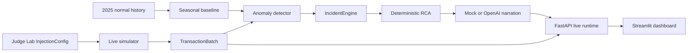

# Codex handoff — MVP-12 final hardening

We are finishing **NextWave Hackathon 2026 — Challenge 2: The Control Tower**.

This repository has just gone through the eight MVP-12 hardening gates. Treat
this document as context, not as proof: inspect the current working tree and
reproduce the relevant checks before making any further claim or change.

## Your role

Act as a senior technical lead reviewing the current MVP-12 implementation.

Before changing anything:

1. Read `AGENTS.md`, `DECISIONS.md`, `README.md`, the MVP-00 contract docs, and
   `backend/schemas.py`.
2. Inspect the current git diff and preserve unrelated/user-owned changes.
3. Verify actual execution paths; do not infer completion merely from file
   existence.
4. Run the full tests and evaluation harness using the commands below.
5. Report any discrepancy with this handoff before implementing more changes.

Do not redesign the architecture, weaken tests, hardcode evaluation scenarios,
change frozen Pydantic schemas, add frameworks, or introduce new product
features. Preserve mock mode and `InjectionConfig` isolation. The LLM must not
participate in detection or deterministic RCA.

## Product flow



`InjectionConfig` must stop at the simulator. Detector, IncidentEngine, RCA,
LLM prompts, and evaluation observations must receive only generated
transactions, incidents, or calculated evidence.

## Work completed during MVP-12

### Gate 1 — normal traffic false positives

- Root cause: sparse seasonal buckets were treated as exact estimates. A noisy
  hour could therefore appear healthier than its stable merchant×country parent
  and create a false alert during normal traffic.
- Fix: approval estimates now use an equivalent-sample shrinkage strength of 50
  toward the merchant×country parent baseline.
- Alternatives evaluated: baseline-estimation uncertainty reduced false
  positives but also lost a supported incident; broad threshold increases were
  rejected.
- Verification: scenario 28 and all agreed normal cases passed; 90 additional
  deterministic normal runs across validation/test, weekday/weekend/night
  produced zero incidents.

### Gate 2 — honest evaluation harness

- A root cause now counts as correct only when
  `diagnosis_status == "confirmed"` and the expected value is represented by the
  confirmed root-cause dimensions.
- Evidence observed during `insufficient_evidence` no longer counts as correct
  RCA.
- Detection and diagnosis classifications are separated, including `DETECTED`,
  `MISSED`, `NO_ALERT`, `FALSE_POSITIVE`, `CONFIRMED`, `ABSTAINED`, and
  `MISDIAGNOSED`.
- Estimated-loss error remains unavailable because there is no independent
  ground-truth loss label.
- Two identical harness runs matched exactly after excluding `generated_at`.

### Gate 3 — real reset

- Added `POST /monitor/reset`.
- Reset recreates simulator and detector from the initial seeded scenario and
  clears recent RCA batches, active injections, live incident storage, and the
  latest batch.
- Three consecutive inject → detect → reset → inject cycles passed and returned
  to `2025-09-02T13:00:00Z` every time.

### Gate 4 — simultaneous incidents and prioritization

- The existing stateless `IncidentEngine` is now used in
  `ControlTowerEvaluationRuntime` and `LiveControlTower`.
- Backend priority remains severity → estimated loss → anomaly score →
  conversion drop.
- Strong scenarios 22–24 each emitted two separate incidents.
- Scenario 25 still emits only the strong incident because its second, mild
  slice is statistically too small at merchant×country level. This was
  documented instead of hardcoded around.

### Gate 5 — real live UI

- Removed hardcoded merchant payloads, fake provider health, random jitter,
  artificial counters, and silent synthetic fallback.
- Added `GET /monitor/latest-batch` using the existing `TransactionBatch`
  contract; no shared schema was changed.
- Streamlit polls `POST /monitor/tick`, reads the latest batch, aggregates actual
  merchant/country KPIs, keeps chart history from real batches, shows real recent
  payments, and consumes backend incident order.
- When FastAPI is stopped, the UI displays an explicit unavailable state and no
  live-looking values.
- Judge Lab and sidebar reset actions call the backend reset endpoint.

### Gate 6 — honest abstention UI

- Confirmed diagnosis displays **Confirmed root cause** and only confirmed
  dimensions.
- Abstention prominently displays:
  **Insufficient evidence to isolate a single root cause.**
- Candidate evidence is labeled:
  **Observed evidence — not sufficient for confirmation**.
- Both states were verified in the live UI.

### Gate 7 — startup and documentation

- `frontend/app.py` adds the repository root to `sys.path`, so the documented
  Streamlit command works without a `PYTHONPATH` override.
- `.env.example` now uses the actual `CONTROL_TOWER_API_URL` variable and defaults
  to `MOCK_MODE=true` for demo safety.
- `README.md` now documents the real product, architecture, setup, startup,
  evaluation, Judge Lab, reset, scope, fallback, and known limitations.
- A literal cold start from the repository root succeeded with the documented
  commands.

### Gate 8 — final trial by fire

- Five consecutive normal windows: zero incidents.
- Clear non-primary combination: Despegar + Brazil + Adyen at 0% was detected and
  confirmed.
- Random supported combination selected after the scenario catalog was frozen:
  Rappi + Brazil + Adyen at 0% was detected generically; RCA abstained honestly.
- Two overlapping Rappi incidents, Mexico and Brazil, remained separate and were
  displayed in backend order.
- Ambiguous Carrefour + Mexico + Adyen case returned
  `insufficient_evidence` and the UI preserved the abstention.
- Money result was non-negative and exactly matched an independent recomputation
  from expected versus actual approved amount.
- Mock mode completed simulator → detector → IncidentEngine → RCA → narration →
  API → UI.
- Injection-isolation contract, prompt, simulator, harness, and RCA tests passed.

## Current verified results

### Full pytest

```text
81 passed, 1 warning in 7.40s
```

The warning is a Starlette/httpx deprecation warning and does not affect the
demo.

Pre-hardening baseline was 71 passing tests.

### Final evaluation harness

| Metric | Before hardening | Current |
|---|---:|---:|
| Evaluated scenarios | 29 | 29 |
| Passed scenarios | 23 | 16 |
| Detection recall | 80.0% | 80.0% |
| False-positive rate | 14.3% | 0.0% |
| Previously reported RCA accuracy | 75.0% | Not used |
| Confirmed root-cause accuracy | Not available | 35.0% |
| Multi-incident separation | 75.0% | 75.0% |
| Abstention accuracy | 100.0% | 100.0% |
| Mean detection latency | 10 minutes | 10 minutes |

The lower number of passing scenarios is intentional: the old harness credited
unconfirmed evidence. Do not alter expectations to improve this number.

Generated artifacts:

- `artifacts/evaluation/evaluation_results.json`
- `artifacts/evaluation/evaluation_summary.md`

`artifacts/` is gitignored.

## Real UI data sources

| Displayed value | Backend source |
|---|---|
| Window advancement | `POST /monitor/tick` |
| Approval rate | Transactions from `GET /monitor/latest-batch` |
| Transaction count | `GET /monitor/latest-batch` |
| Country metrics | Real aggregation of the latest batch |
| Recent payments | Real transactions from the latest batch |
| Chart | Session history made only from received batches |
| Incidents and priority | `GET /merchants/{merchant}/incidents` |
| RCA and recommendation | Backend diagnosed incidents |
| Clean lifecycle | `POST /monitor/reset` |

No fake live jitter or synthetic UI fallback should remain.

## Exact commands already tested

Install:

```bash
python3 -m venv .venv
source .venv/bin/activate
python -m pip install --upgrade pip
python -m pip install -r requirements.txt
cp .env.example .env
```

Backend:

```bash
source .venv/bin/activate
uvicorn backend.main:app --reload --port 8000
```

Frontend:

```bash
source .venv/bin/activate
streamlit run frontend/app.py
```

Tests:

```bash
python -m pytest -q
```

Evaluation:

```bash
python -m backend.evaluation --output artifacts/evaluation
```

## Known-good demo injection

Use Judge Lab with:

```text
Merchant: Rappi
Country: Brazil
Provider: Stripe
Target approval rate: 20%
Duration: 6 windows
```

Expected path:

```text
injection
→ generated transaction behavior changes
→ detector emits Incident after persistence
→ IncidentEngine prioritizes it
→ deterministic RCA returns Diagnosis
→ mock narration produces explanation/recommendation
→ dashboard updates automatically
```

## Supported Judge Lab policy

Promise statistically observable slices only:

- merchant + country;
- merchant + country + one provider;
- merchant + country + one payment method;
- merchant + country + one issuing bank;
- decline-code degradation when sufficient volume exists;
- intersections only when they contain sufficient traffic.

The primary Judge Lab should not allow more than one optional provider/method/bank
filter. Do not expand the detector late to support arbitrary tiny intersections.

## Remaining known limitations

1. Detector aggregation is merchant×country. Narrow intersections can be missed.
2. Catalog scenarios 17–19 and 30 remain detection misses.
3. Scenario 25's mild second incident remains below supported signal.
4. Strict confirmed RCA accuracy is 35%; several detected incidents correctly
   abstain rather than fabricate a cause.
5. Active incidents do not automatically resolve after traffic recovery; reset
   is required between rehearsals.
6. There is no independent ground-truth loss, so loss-error accuracy cannot be
   reported.
7. Real OpenAI mode has no proven automatic fallback after an external API
   failure. **Use `MOCK_MODE=true` as the primary demo mode.**
8. State is in memory: no database, authentication, durable history, or
   multi-user isolation.

## Files changed by MVP-12

- `.env.example`
- `README.md`
- `backend/baseline/seasonal.py`
- `backend/evaluation/harness.py`
- `backend/incidents/engine.py`
- `backend/integration/evaluation_runtime.py`
- `backend/live_control_tower.py`
- `backend/main.py`
- `docs/mvp_03_evaluation.md`
- `frontend/app.py`
- `frontend/live_data.py`
- `frontend/pages/0_Client.py`
- `frontend/pages/1_Judge_Lab.py`
- `tests/test_detector.py`
- `tests/test_evaluation_harness.py`
- `tests/test_evaluation_runtime.py`
- `tests/test_frontend_live_data.py`
- `tests/test_live_control_tower.py`
- `tests/test_seasonal_baseline.py`

`docs/MVP_12_AUDIT_DECISION_BRIEF.md` was already an untracked user-owned file
before this work and must not be overwritten or attributed to this change.

## Current recommendation

**MVP READY WITH KNOWN LIMITATIONS.**

The safest next action is to review the current diff, rerun pytest and the
evaluation harness, and prepare a focused commit/PR only if explicitly requested.
Do not perform unrelated cleanup or architecture changes before the demo.

## Five-minute pre-demo smoke check

1. Confirm `.env` has `MOCK_MODE=true`.
2. Start FastAPI and verify `/health`.
3. Start Streamlit and confirm `LIVE BACKEND`.
4. Click **Reset demo**.
5. Observe two or three normal windows with no incident.
6. Inject Rappi + Brazil + Stripe at 20% for six windows.
7. Confirm metric movement, incident, loss, diagnosis status, and recommendation.
8. Reset again and confirm a clean dashboard.
9. Do not enable OpenAI real mode immediately before the presentation.
